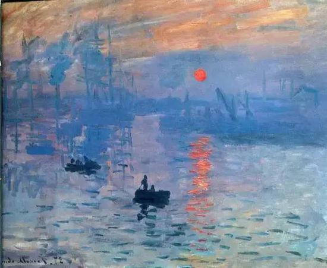

## Painting Selection: Monet’s Impression, Sunrise

**Part 1: Imaging Technique Inspiration**
Monet's *Impression, Sunrise* beautifully showcases the interplay of light, shadows, and water reflections through soft gradients. To replicate this effect, I will use the **lerpColor()** function in p5.js for a seamless transition between warm and cool sky tones. Additionally, I will employ the **noise()** function to create realistic water ripples that reflect light. Together, these techniques will evoke the tranquil, reflective ambiance of Monet's masterpiece.

**Part 2: Coding Technique Exploration**
The **lerpColor()** function enables smooth color blending, effectively mimicking the painting's light gradients. Meanwhile, the **noise()** function produces irregular patterns on the water's surface, creating realistic ripple effects. By combining these techniques, I will enhance the scene's visual depth and atmosphere, capturing the essence of Monet's work.

**Here are some links to reference technologies:**
>[Gradient using lerpColor](https://editor.p5js.org/awcuny/sketches/dc_qJe6V3)

>[Simulating Water Reflections](https://blog.csdn.net/yyx112358/article/details/79109212)

